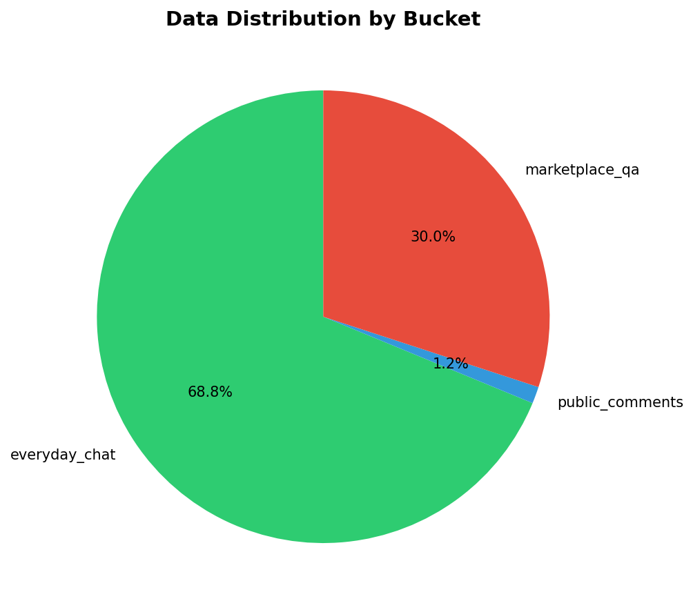
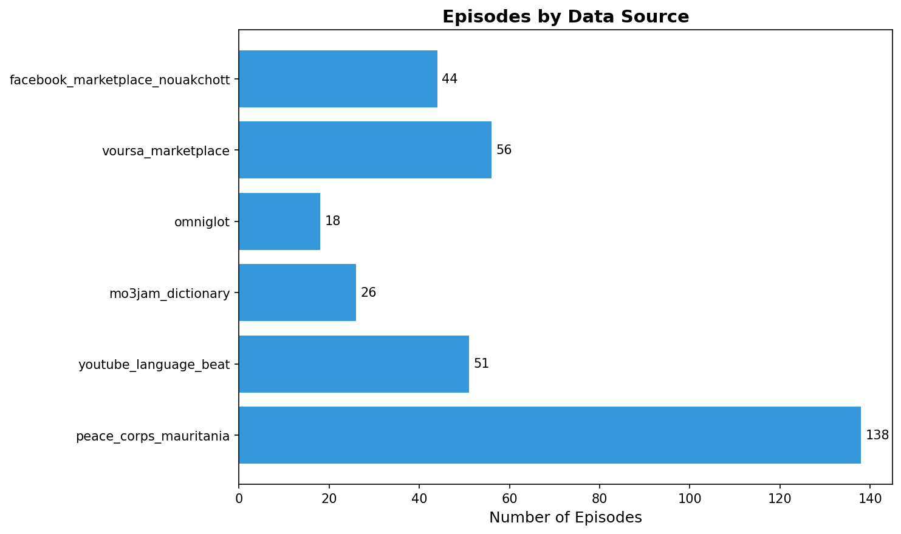
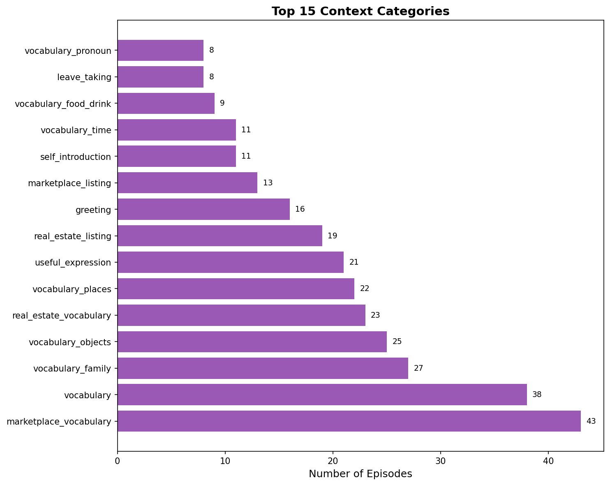

# Hassaniya Dialect Data Collection Report

**Generated:** January 5, 2026  
**Repository:** [lemneya/hassania-data-pipeline](https://github.com/lemneya/hassania-data-pipeline)

---

## Executive Summary

This report documents the comprehensive data collection effort for the Hassaniya Arabic dialect, spoken primarily in Mauritania and surrounding regions. The collected data is intended for fine-tuning language models to understand and generate authentic Hassaniya content.

**Total Episodes Collected:** 333  
**Unique Data Sources:** 8  
**Data Buckets:** 3

---

## 1. Dataset Overview

### 1.1 Distribution by Bucket

The data is organized into three functional buckets:

| Bucket | Episodes | Percentage | Description |
|--------|----------|------------|-------------|
| `everyday_chat` | 229 | 68.8% | Greetings, phrases, vocabulary for daily conversation |
| `marketplace_qa` | 100 | 30.0% | Product listings, real estate, commercial vocabulary |
| `public_comments` | 4 | 1.2% | Social media posts, proverbs, public discussions |



### 1.2 Distribution by Source

| Source | Episodes | Percentage |
|--------|----------|------------|
| peace_corps_mauritania | 138 | 41.4% |
| voursa_marketplace | 56 | 16.8% |
| youtube_language_beat | 51 | 15.3% |
| facebook_marketplace_nouakchott | 44 | 13.2% |
| mo3jam_dictionary | 26 | 7.8% |
| omniglot | 18 | 5.4% |



---

## 2. Raw Data Sources

### 2.1 Source Details

#### Mo3jam Hassaniya Dictionary

- **Type:** Dictionary
- **File:** `dictionary/mo3jam_hassaniya.json`
- **Total Items:** 25

- **Vocabulary Terms:** 21
- **Proverbs:** 4

#### Voursa Marketplace - Automobiles

- **Type:** Marketplace
- **File:** `marketplace/voursa_detailed_listings.json`
- **Total Items:** 13

- **Listings:** 1
- **Vocabulary:** 12

#### Voursa Marketplace - Real Estate

- **Type:** Marketplace
- **File:** `marketplace/voursa_real_estate.json`
- **Total Items:** 42

- **Listings:** 19
- **Vocabulary:** 23
- **Detailed:** 1

#### Facebook Marketplace Nouakchott

- **Type:** Marketplace
- **File:** `marketplace/facebook_marketplace_nouakchott.json`
- **Total Items:** 25

- **Listings:** 8
- **Additional:** 5
- **Vocabulary:** 12

#### Peace Corps Mauritania

- **Type:** Learning Materials
- **File:** `reference/peace_corps_hassaniya_structured.json`
- **Total Items:** 177

- **Lessons:** 10
- **Greetings:** 14
- **Vocabulary Categories:** 6

#### Omniglot Reference

- **Type:** Reference
- **File:** `reference/omniglot_hassaniya.json`
- **Total Items:** 18

- **Vocabulary:** 17
- **Has Sample Text:** True

#### YouTube - Hassaniya Greetings

- **Type:** Video
- **File:** `video/youtube_hassaniya_greetings.json`
- **Total Items:** 6

- **Duration:** 5:58
- **Phrases:** 6

#### YouTube - Lessons 1-10

- **Type:** Video
- **File:** `video/youtube_hassaniya_lessons_1_10.json`
- **Total Items:** 52

- **Duration:** 21:09
- **Categories:** 10

---

## 3. Context Categories

The data is tagged with contextual information to enable targeted fine-tuning.



### Top 15 Contexts

| Context | Count |
|---------|-------|
| marketplace_vocabulary | 43 |
| vocabulary | 38 |
| vocabulary_family | 27 |
| vocabulary_objects | 25 |
| real_estate_vocabulary | 23 |
| vocabulary_places | 22 |
| useful_expression | 21 |
| real_estate_listing | 19 |
| greeting | 16 |
| marketplace_listing | 13 |
| self_introduction | 11 |
| vocabulary_time | 11 |
| vocabulary_food_drink | 9 |
| leave_taking | 8 |
| vocabulary_pronoun | 8 |


---

## 4. Sample Data Entries

Below are sample entries from the processed dataset:

### Sample 1

| Field | Value |
|-------|-------|
| English | Peace be upon you (use at any time of the day) |
| Hassaniya (Arabic) | Is-selaamu caleykum |
| Hassaniya (Latin) | Is-selaamu caleykum |
| Bucket | `everyday_chat` |
| Source | peace_corps_mauritania |
| Context | greeting |

### Sample 2

| Field | Value |
|-------|-------|
| English | And on you, too (reply) |
| Hassaniya (Arabic) | We caleykum is-selaam |
| Hassaniya (Latin) | We caleykum is-selaam |
| Bucket | `everyday_chat` |
| Source | peace_corps_mauritania |
| Context | greeting |

### Sample 3

| Field | Value |
|-------|-------|
| English | Good morning |
| Hassaniya (Arabic) | Ish haal is-sbaah |
| Hassaniya (Latin) | Ish haal is-sbaah |
| Bucket | `everyday_chat` |
| Source | peace_corps_mauritania |
| Context | greeting |

### Sample 4

| Field | Value |
|-------|-------|
| English | Good afternoon |
| Hassaniya (Arabic) | Ish haal li-mgiil |
| Hassaniya (Latin) | Ish haal li-mgiil |
| Bucket | `everyday_chat` |
| Source | peace_corps_mauritania |
| Context | greeting |

### Sample 5

| Field | Value |
|-------|-------|
| English | Good evening |
| Hassaniya (Arabic) | Ish haal li-mbaat |
| Hassaniya (Latin) | Ish haal li-mbaat |
| Bucket | `everyday_chat` |
| Source | peace_corps_mauritania |
| Context | greeting |

---

## 5. Key Hassaniya Vocabulary Collected

### Marketplace Terms
| Hassaniya | Meaning |
|-----------|---------|
| نيمرو | Plot number (from French numéro) |
| احذ | Near/beside |
| اكريب | Close to |
| ابرتماه | Apartment (from French appartement) |
| كوزين | Kitchen (from French cuisine) |
| فرند | Veranda (from French véranda) |
| دوشات | Showers (from French douche) |
| ذوك | These (demonstrative) |

### Everyday Expressions
| Hassaniya | Meaning |
|-----------|---------|
| اشحالك | How are you? |
| لاباس | Fine/good |
| مرحبا | Welcome |
| شكران | Thank you |

---

## 6. Data Quality Notes

- **Parallel Data:** All 333 episodes contain English, Arabic script, and Latin transliteration
- **Source Diversity:** Data collected from 6 distinct source types
- **Authenticity:** Marketplace data reflects real-world Mauritanian usage
- **French Loanwords:** Captured the characteristic French influence in Hassaniya

---

## 7. Recommendations for Future Collection

1. **Expand public_comments bucket** - Currently only 4 episodes (1.2%)
2. **Add more conversational dialogues** - Multi-turn conversations for chat fine-tuning
3. **Include audio transcriptions** - For speech-to-text applications
4. **Collect regional variations** - Northern Mauritania vs. Western Sahara dialects

---

## Appendix: File Structure

```
hassania-data-pipeline/
├── data/
│   ├── raw/
│   │   ├── dictionary/mo3jam_hassaniya.json
│   │   ├── facebook/hassaniya_page_data.json
│   │   ├── marketplace/
│   │   │   ├── facebook_marketplace_nouakchott.json
│   │   │   ├── voursa_detailed_listings.json
│   │   │   └── voursa_real_estate.json
│   │   ├── reference/
│   │   │   ├── omniglot_hassaniya.json
│   │   │   ├── peace_corps_hassaniya.pdf
│   │   │   └── peace_corps_hassaniya_structured.json
│   │   ├── social/
│   │   │   ├── facebook_mauritania_hassaniya.json
│   │   │   └── reddit_hassaniya.json
│   │   └── video/
│   │       ├── youtube_hassaniya_greetings.json
│   │       └── youtube_hassaniya_lessons_1_10.json
│   └── processed/
│       ├── hassaniya_hdrp.csv
│       ├── hassaniya_hdrp.jsonl
│       └── hdrp_summary.json
├── reports/
│   ├── DATA_COLLECTION_REPORT.md
│   ├── bucket_distribution.png
│   ├── source_distribution.png
│   └── context_distribution.png
└── scripts/
    ├── convert_to_hdrp.py
    ├── create_report.py
    └── generate_report.py
```

---

*Report generated by Manus AI*
