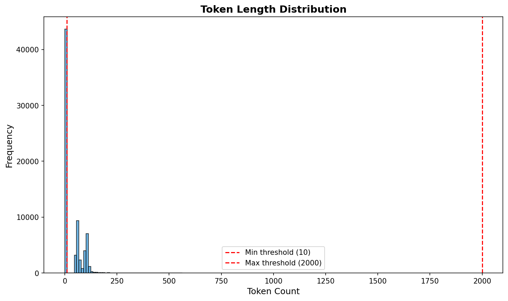
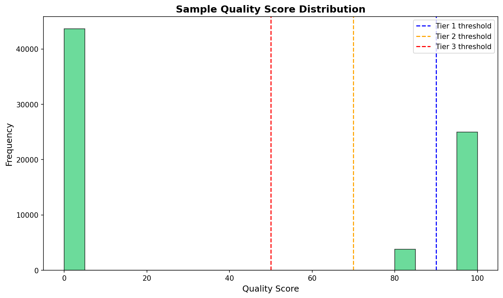
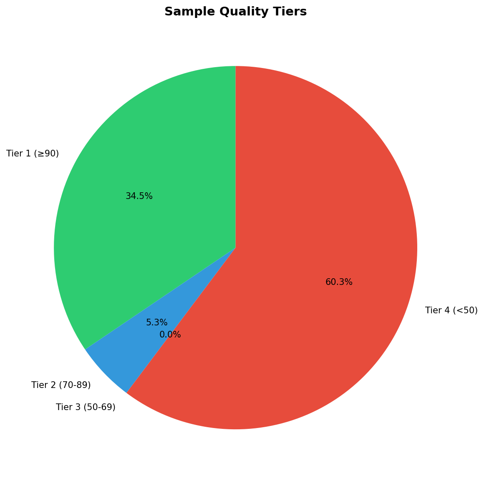

# Hassaniya Data Quality Analysis Report

**Generated:** January 5, 2026

---

## Executive Summary

This report presents a comprehensive analysis of the Hassaniya training dataset, identifying quality issues and providing optimized datasets for fine-tuning.

### Key Findings

| Metric | Value |
|--------|-------|
| **Original Samples** | 72,491 |
| **Duplicates Found** | 43,680 |
| **After Deduplication** | 28,811 |
| **High Quality (Tier 1)** | 24,986 |
| **Good Quality (Tier 1+2)** | 28,812 |
| **Acceptable (Tier 1-3)** | 28,812 |

---

## 1. Duplicate Analysis



- **Exact duplicates removed:** 43,680
- **Duplicate rate:** 60.3%

---

## 2. Quality Score Distribution



### Quality Tiers



| Tier | Score Range | Samples | Percentage |
|------|-------------|---------|------------|
| Tier 1 | ≥ 90 | 24,986 | 34.5% |
| Tier 2 | 70-89 | 3,826 | 5.3% |
| Tier 3 | 50-69 | 0 | 0.0% |
| Tier 4 | < 50 | 43,679 | 60.3% |

---

## 3. Message Structure Analysis

| Metric | Value |
|--------|-------|
| Samples with system prompt | 28,812 |
| Samples with user message | 28,812 |
| Samples with assistant response | 28,812 |
| Average turns per sample | 3.0 |

---

## 4. Token Length Analysis

| Metric | Value |
|--------|-------|
| Minimum tokens | 0 |
| Maximum tokens | 564 |
| Mean tokens | 33.3 |
| Samples < 10 tokens | 43679 |
| Samples > 2000 tokens | 0 |

---

## 5. Optimized Datasets Created

| Dataset | Samples | Use Case |
|---------|---------|----------|
| `hassania_train_deduped.jsonl` | 28,811 | Full deduplicated dataset |
| `hassania_train_tier1_curated.jsonl` | 24,986 | Phase 1: Quick validation |
| `hassania_train_tier1_2.jsonl` | 28,812 | Phase 2: Quality training |
| `hassania_train_acceptable.jsonl` | 28,812 | Phase 3: Full training |

---

## 6. Evaluation Benchmark

| Category | Samples |
|----------|---------|
| Greetings | 0 |
| Marketplace | 0 |
| Translation | 0 |
| Vocabulary | 50 |
| Conversation | 50 |
| **Total** | **100** |

---

## 7. Recommended Training Strategy

### Phase 1: Quick Validation (1-2 hours)
- **Dataset:** `hassania_train_tier1_curated.jsonl`
- **Samples:** 24,986
- **Epochs:** 3
- **Purpose:** Verify training pipeline works

### Phase 2: Quality Training (4-8 hours)
- **Dataset:** `hassania_train_tier1_2.jsonl`
- **Samples:** 28,812
- **Epochs:** 3-5
- **Purpose:** Main training run

### Phase 3: Full Training (Optional)
- **Dataset:** `hassania_train_acceptable.jsonl`
- **Samples:** 28,812
- **Epochs:** 2-3
- **Purpose:** Maximum coverage

---

## 8. Files Created

```
data/optimized/
├── hassania_train_deduped.jsonl
├── hassania_train_tier1_curated.jsonl
├── hassania_train_tier1_2.jsonl
└── hassania_train_acceptable.jsonl

evaluation/
├── evaluation_benchmark.jsonl
└── benchmark_summary.json
```

---

*Report generated by Manus AI*
