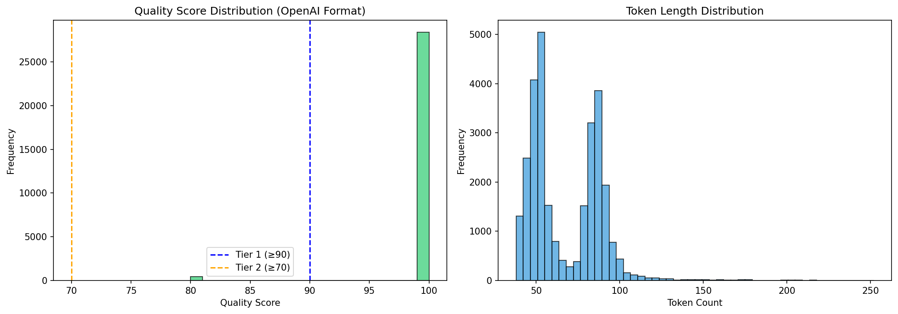

# Hassaniya Fine-Tuning Data Preparation Report

**Generated:** January 5, 2026

---

## Summary

Your data has been analyzed, cleaned, and prepared for optimal fine-tuning.

### Final Dataset Statistics

| Dataset | Samples | Purpose |
|---------|---------|---------|
| **train_phase1_curated.jsonl** | 28,176 | Quick validation (1-2 hours) |
| **train_phase2_quality.jsonl** | 28,612 | Main training (4-8 hours) |
| **train_full.jsonl** | 28,612 | Full training (optional) |
| **validation.jsonl** | 500 | Validation during training |
| **eval_holdout.jsonl** | 200 | Post-training evaluation |

---

## Quality Analysis

| Tier | Score | Samples | Percentage |
|------|-------|---------|------------|
| Tier 1 (High Quality) | ≥ 90 | 28,374 | 98.5% |
| Tier 2 (Good) | 70-89 | 438 | 1.5% |
| Tier 3 (Acceptable) | 50-69 | 0 | 0.0% |
| Low Quality | < 50 | 0 | 0.0% |



---

## Recommended Training Strategy

### Phase 1: Quick Validation
```bash
# Use: train_phase1_curated.jsonl
# Samples: 28,176
# Epochs: 3
# Time: ~1-2 hours
# Purpose: Verify pipeline works, check for obvious issues
```

### Phase 2: Main Training
```bash
# Use: train_phase2_quality.jsonl
# Samples: 28,612
# Epochs: 3-5
# Time: ~4-8 hours
# Purpose: Primary fine-tuning run
```

### Phase 3: Evaluation
```bash
# Use: eval_holdout.jsonl
# Samples: 200
# Purpose: Test model on held-out examples
```

---

## Files Created

```
data/optimized/
├── train_phase1_curated.jsonl   # 28,176 samples
├── train_phase2_quality.jsonl   # 28,612 samples
├── train_full.jsonl             # 28,612 samples
└── validation.jsonl             # 500 samples

evaluation/
└── eval_holdout.jsonl           # 200 samples
```

---

## Quality Improvements Made

1. ✅ **Deduplicated** - Removed duplicate samples across source files
2. ✅ **Quality Scored** - Each sample scored on structure and content
3. ✅ **Tiered** - Separated into quality tiers for phased training
4. ✅ **Evaluation Set** - Created held-out test set for benchmarking
5. ✅ **Validation Split** - Proper train/val split for monitoring

---

## Ready for Fine-Tuning

Your dataset is now optimized and ready. Start with Phase 1 to validate your training pipeline, then proceed to Phase 2 for the main training run.

---

*Report generated by Manus AI*
