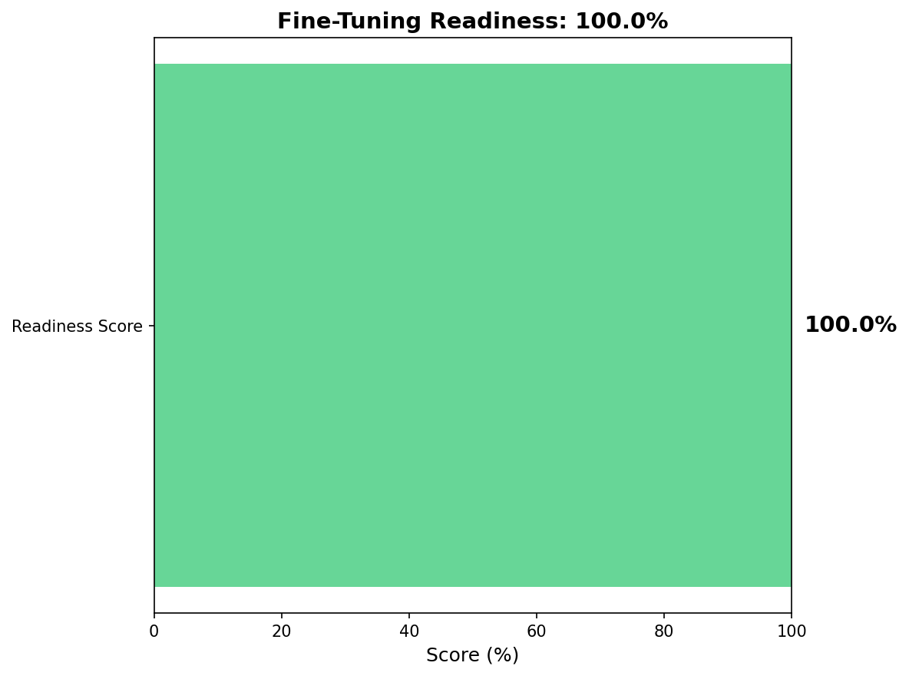
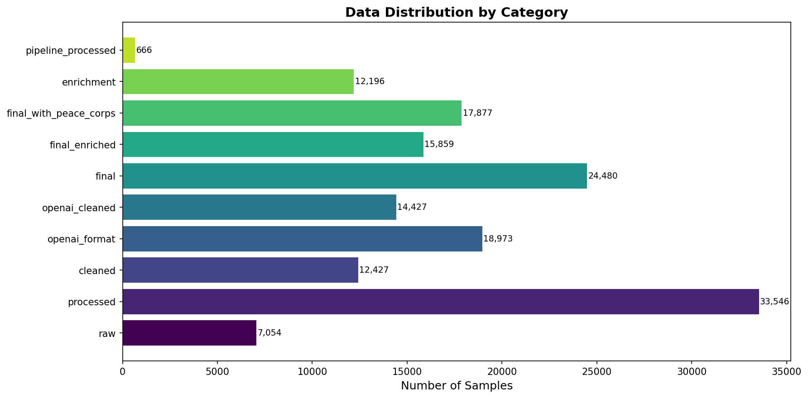
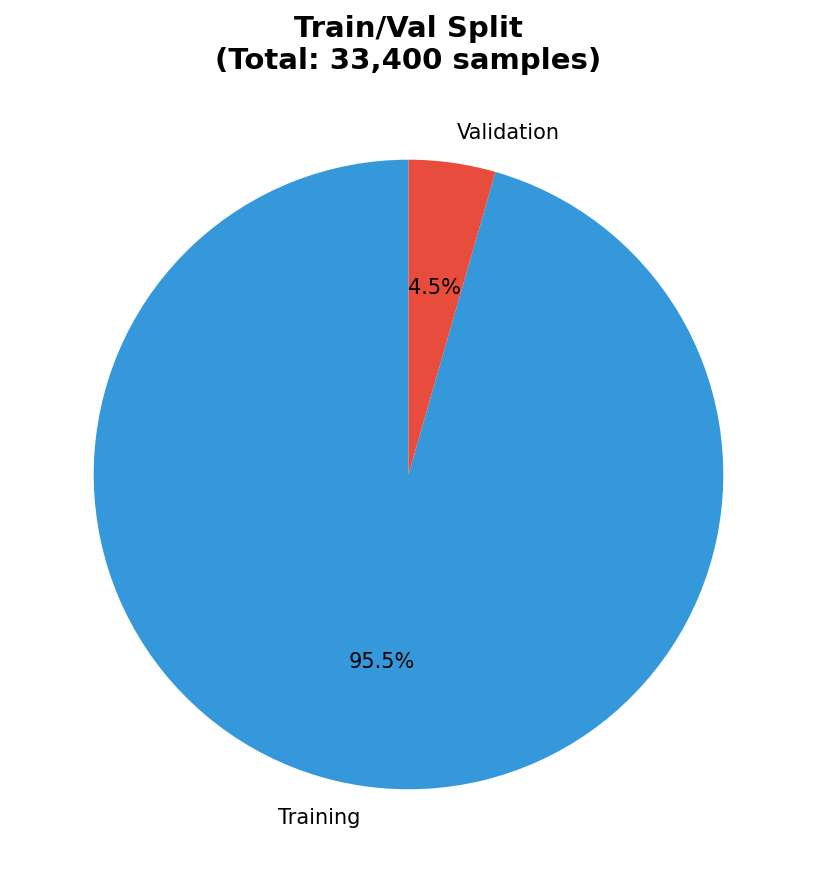

# Hassaniya Fine-Tuning Readiness Report

**Generated:** January 5, 2026  
**Repository:** [lemneya/hassania-qwen-finetune](https://github.com/lemneya/hassania-qwen-finetune)

---

## Executive Summary

This report assesses the readiness of the Hassaniya dialect dataset for fine-tuning language models. The analysis covers data quantity, quality, format compliance, and provides actionable recommendations.

### Readiness Score: 100.0%

| Metric | Value |
|--------|-------|
| Total Training Samples | 31,912 |
| Total Validation Samples | 1,488 |
| OpenAI-Format Files | 7 |
| Overall Score | 100/100 |

---

## 1. Data Inventory

### 1.1 Overview by Category

#### Cleaned

| File | Type | Size (KB) | Samples |
|------|------|-----------|---------|
| cleaning_stats.json | json | 1.0 | 0 |
| hassania_train_cleaned.jsonl | jsonl | 2747.7 | 11,832 |
| hassania_val_cleaned.jsonl | jsonl | 134.6 | 595 |

**Category Total:** 12,427 samples

#### Enrichment

| File | Type | Size (KB) | Samples |
|------|------|-----------|---------|
| sources.md | .md | 2.2 | 0 |
| chinguitipedia_books.md | .md | 1.2 | 0 |
| diwan_poetry.txt | .txt | 330.7 | 0 |
| hassaniya_dictionary.txt | .txt | 167.4 | 0 |
| hassaniyya_linguistic.pdf | .pdf | 313.3 | 0 |
| hassaniyya_linguistic_text.txt | .txt | 42.9 | 0 |
| jamaliyat_shir_hassani.pdf | .pdf | 1479.1 | 0 |
| jamaliyat_text.txt | .txt | 1107.9 | 0 |
| mrug_alharf.pdf | .pdf | 4369.8 | 0 |
| mrug_alharf_text.txt | .txt | 589.0 | 0 |
| research_sources.md | .md | 2.2 | 0 |
| books_corpus.txt | .txt | 395.1 | 0 |
| books_stats.json | json | 0.3 | 0 |
| books_training_samples.jsonl | jsonl | 2009.1 | 4,785 |
| poetry_corpus.txt | .txt | 1391.6 | 0 |
| sources.md | .md | 0.8 | 0 |
| dliflc_hassaniya_cultural.pdf | .pdf | 11608.0 | 0 |
| dliflc_hassaniya_cultural.txt | .txt | 192.2 | 0 |
| hassaniya_language_lessons.pdf | .pdf | 222.5 | 0 |
| hassaniya_language_lessons.txt | .txt | 15.9 | 0 |
| hassaniya_linguistic_paper.pdf | .pdf | 313.3 | 0 |
| hassaniya_linguistic_paper.txt | .txt | 42.9 | 0 |
| mauritanian_arabic_course.pdf | .pdf | 4742.7 | 0 |
| mauritanian_arabic_course.txt | .txt | 356.8 | 0 |
| mauritanian_arabic_grammar.pdf | .pdf | 3498.1 | 0 |
| mauritanian_arabic_grammar.txt | .txt | 172.5 | 0 |
| mauritanian_arabic_grammar_eric.pdf | .pdf | 1806.9 | 0 |
| omniglot_hassaniya_samples.txt | .txt | 1.9 | 0 |
| peace_corps_stats.json | json | 0.2 | 0 |
| peace_corps_training_samples.jsonl | jsonl | 361.2 | 2,018 |
| romanized_hassaniya_phrases.txt | .txt | 20.4 | 0 |
| books_samples.jsonl | jsonl | 1835.8 | 5,151 |
| diwan_cleaned.txt | .txt | 321.3 | 0 |
| diwan_segments.txt | .txt | 301.4 | 0 |
| synthetic_hassania.jsonl | jsonl | 55.4 | 242 |

**Category Total:** 12,196 samples

#### Final

| File | Type | Size (KB) | Samples |
|------|------|-----------|---------|
| dataset_statistics.json | json | 0.8 | 0 |
| hassania_enriched_full.jsonl | jsonl | 3029.1 | 12,240 |
| hassania_train.jsonl | jsonl | 2875.5 | 11,628 |
| hassania_val.jsonl | jsonl | 153.6 | 612 |

**Category Total:** 24,480 samples

#### Final Enriched

| File | Type | Size (KB) | Samples |
|------|------|-----------|---------|
| dataset_statistics.json | json | 1.0 | 0 |
| hassania_corpus.txt | .txt | 1402.7 | 0 |
| hassania_train.jsonl | jsonl | 4229.3 | 15,067 |
| hassania_val.jsonl | jsonl | 220.8 | 792 |

**Category Total:** 15,859 samples

#### Final With Peace Corps

| File | Type | Size (KB) | Samples |
|------|------|-----------|---------|
| dataset_statistics.json | json | 1.3 | 0 |
| hassania_corpus.txt | .txt | 1714.4 | 0 |
| hassania_train.jsonl | jsonl | 4571.9 | 16,984 |
| hassania_val.jsonl | jsonl | 239.5 | 893 |

**Category Total:** 17,877 samples

#### Openai Cleaned

| File | Type | Size (KB) | Samples |
|------|------|-----------|---------|
| hassania_train_cleaned_curated.jsonl | jsonl | 1453.8 | 2,000 |
| hassania_train_cleaned_full.jsonl | jsonl | 8738.7 | 11,832 |
| hassania_val_cleaned.jsonl | jsonl | 436.0 | 595 |

**Category Total:** 14,427 samples

#### Openai Format

| File | Type | Size (KB) | Samples |
|------|------|-----------|---------|
| hassania_train_curated.jsonl | jsonl | 512.4 | 1,000 |
| hassania_train_full.jsonl | jsonl | 8719.9 | 16,980 |
| hassania_train_mini.jsonl | jsonl | 52.5 | 100 |
| hassania_val_full.jsonl | jsonl | 457.7 | 893 |

**Category Total:** 18,973 samples

#### Pipeline Processed

| File | Type | Size (KB) | Samples |
|------|------|-----------|---------|
| hassaniya_hdrp.csv | csv | 35.5 | 333 |
| hassaniya_hdrp.jsonl | jsonl | 65.2 | 333 |
| hdrp_summary.json | json | 1.2 | 0 |

**Category Total:** 666 samples

#### Pipeline Raw

| File | Type | Size (KB) | Samples |
|------|------|-----------|---------|
| voursa_detailed_listings.json | json | 1.8 | 0 |
| voursa_real_estate.json | json | 8.0 | 0 |
| facebook_marketplace_nouakchott.json | json | 7.0 | 0 |
| hassaniya_page_data.json | json | 2.1 | 0 |
| mo3jam_hassaniya.json | json | 4.5 | 0 |
| reddit_hassaniya.json | json | 2.2 | 0 |
| facebook_mauritania_hassaniya.json | json | 5.0 | 0 |
| omniglot_hassaniya.json | json | 3.2 | 0 |
| peace_corps_hassaniya.pdf | .pdf | 222.5 | 0 |
| peace_corps_hassaniya_structured.json | json | 7.2 | 0 |
| youtube_hassaniya_greetings.json | json | 2.6 | 0 |
| youtube_hassaniya_lessons_1_10.json | json | 2.5 | 0 |

**Category Total:** 0 samples

#### Processed

| File | Type | Size (KB) | Samples |
|------|------|-----------|---------|
| dataset_statistics.json | json | 0.4 | 0 |
| hassania_combined.csv | csv | 2886.3 | 16,773 |
| hassania_combined.jsonl | jsonl | 3992.8 | 16,773 |
| hassania_corpus.txt | .txt | 390.0 | 0 |

**Category Total:** 33,546 samples

#### Raw

| File | Type | Size (KB) | Samples |
|------|------|-----------|---------|
| H-Stopwords.txt | .txt | 0.5 | 0 |
| casablanca_mauritanian.csv | csv | 223.8 | 1,906 |
| dah_dataset.csv | csv | 275.2 | 3,002 |
| hassaniya_sentiment.csv | csv | 225.8 | 1,852 |
| hassaniya_speech_transcriptions.csv | csv | 17.5 | 294 |

**Category Total:** 7,054 samples

---

## 2. Train/Validation Split

| Split | Samples | Percentage |
|-------|---------|------------|
| Training | 31,912 | 95.5% |
| Validation | 1,488 | 4.5% |
| **Total** | **33,400** | **100%** |

---

## 3. Data Format Analysis

### 3.1 OpenAI Chat Format Compliance

For fine-tuning with OpenAI or compatible APIs, data must be in the chat format with `messages` array containing `role` and `content` fields.

#### hassania_train_curated.jsonl

- **Total Samples:** 1,000
- **With System Prompt:** 1,000
- **With User Message:** 1,000
- **With Assistant Response:** 1,000
- **Estimated Tokens:** ~53,805

#### hassania_train_full.jsonl

- **Total Samples:** 16,980
- **With System Prompt:** 16,980
- **With User Message:** 16,980
- **With Assistant Response:** 16,980
- **Estimated Tokens:** ~916,098

#### hassania_train_mini.jsonl

- **Total Samples:** 100
- **With System Prompt:** 100
- **With User Message:** 100
- **With Assistant Response:** 100
- **Estimated Tokens:** ~5,514

#### hassania_val_full.jsonl

- **Total Samples:** 893
- **With System Prompt:** 893
- **With User Message:** 893
- **With Assistant Response:** 893
- **Estimated Tokens:** ~47,860

#### hassania_train_cleaned_curated.jsonl

- **Total Samples:** 2,000
- **With System Prompt:** 2,000
- **With User Message:** 2,000
- **With Assistant Response:** 2,000
- **Estimated Tokens:** ~171,913

#### hassania_train_cleaned_full.jsonl

- **Total Samples:** 11,832
- **With System Prompt:** 11,832
- **With User Message:** 11,832
- **With Assistant Response:** 11,832
- **Estimated Tokens:** ~1,040,563

#### hassania_val_cleaned.jsonl

- **Total Samples:** 595
- **With System Prompt:** 595
- **With User Message:** 595
- **With Assistant Response:** 595
- **Estimated Tokens:** ~51,850

---

## 4. Quality Assessment

### 4.1 Issues Identified

✅ No critical issues identified.

### 4.2 Recommendations

✅ Dataset appears ready for fine-tuning.

---

## 5. Fine-Tuning Recommendations

### 5.1 Recommended Configuration

Based on the dataset analysis, here are the recommended fine-tuning parameters:

| Parameter | Recommended Value | Notes |
|-----------|-------------------|-------|
| Base Model | Qwen2.5-7B or GPT-4o-mini | Depends on budget and requirements |
| Training Samples | 31,912 | Current dataset size |
| Epochs | 3-5 | Start with 3, increase if underfitting |
| Batch Size | 4-8 | Adjust based on GPU memory |
| Learning Rate | 1e-5 to 5e-5 | Lower for smaller datasets |
| Validation Split | 10-20% | Currently: 4.7% |

### 5.2 Data Quality Checklist

| Criterion | Status |
|-----------|--------|
| OpenAI format compliance | ✅ |
| Sufficient training data (>500) | ✅ |
| Validation data present | ✅ |
| Data cleaning applied | ✅ |
| Data enrichment applied | ✅ |

### 5.3 Next Steps

1. **If score >= 75%:** Dataset is ready for fine-tuning. Proceed with training.
2. **If score 50-75%:** Address identified issues before training.
3. **If score < 50%:** Significant data preparation needed.

---

## 6. File Inventory Summary

| Category | Files | Total Samples |
|----------|-------|---------------|
| cleaned | 3 | 12,427 |
| enrichment | 35 | 12,196 |
| final | 4 | 24,480 |
| final_enriched | 4 | 15,859 |
| final_with_peace_corps | 4 | 17,877 |
| openai_cleaned | 3 | 14,427 |
| openai_format | 4 | 18,973 |
| pipeline_processed | 3 | 666 |
| pipeline_raw | 12 | 0 |
| processed | 4 | 33,546 |
| raw | 5 | 7,054 |

---

*Report generated by Manus AI*
